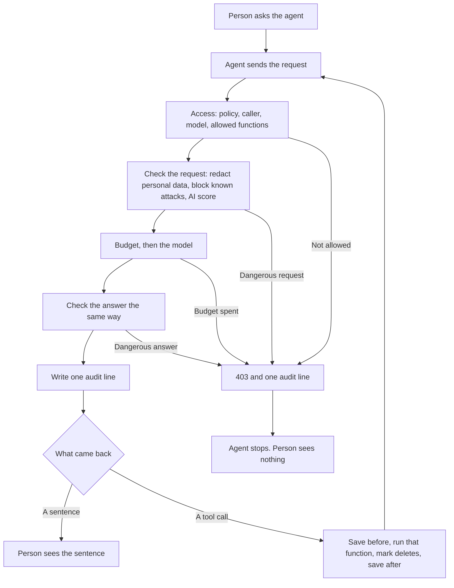

# Control layer

The proxy sits on `POST /v1/chat/completions`. Point an agent at it by changing `base_url`. The agent keeps its own client. The proxy checks the request, calls Jev when the cheap checks did not already decide, forwards the call to OpenAI, and writes an audit line.

## Run the proxy

```bash
python3 -m venv .venv
.venv/bin/pip install -e .
make run
```

`make run` starts uvicorn for `src/control/app.py` on `127.0.0.1:8000`.

Set `base_url` to `http://127.0.0.1:8000/v1`.

Send the header `X-Agent-Id`. `policy/standard.yaml` allows the agent id `demo` with model `gpt-4o-mini`.

The process reads `OPENAI_APIKEY` and `VERCEL_APIKEY` from `.env.local` when those variables are missing from the environment.

Open the report page at `/`.

## Edit the catalog

`POLICY_PATH` defaults to `policy/standard.yaml`.

`SIGNATURES_PATH` defaults to `signatures.json`.

`DATA_DIR` defaults to `data`.

`policy/standard.yaml` uses `mode: redact`. A match that can be stripped is replaced with `[REDACTED]`. A secret still stops the request.

`policy/strict.yaml` uses `mode: strict`. The same match stops the agent.

Each control in the file can be set to `false`. The page at `/` edits those flags. The next request reads the file again.

Each request reads both files again. A file that fails to parse keeps the last successful parse of that path. Spend is stored in `data/budget.json`. The audit log is `data/audit.jsonl`.

## Run the tests

```bash
make test
```

`make test` runs `pytest` against the real OpenAI API and the real Vercel AI Gateway. The suite reads the keys from `.env.local`.

## Pipeline



A block stops the request. The output scan still records the OpenAI token cost before it returns 403. Prompt, tool arguments, and tool results go to Jev together after redaction, each labeled, so the call sees `[REDACTED]` and not the original secret. The model answer goes to Jev with that same request only when the cheap checks left the answer as Allow.

## OWASP LLM checks

| OWASP id | What this proxy does |
| --- | --- |
| LLM01 Prompt Injection | `ignore_previous` and `instruction_override` |
| LLM02 Sensitive Information Disclosure | Email and secret checks on the way out |
| LLM03 Supply Chain | `pickle` and `model_host` |
| LLM05 Improper Output Handling | Output scan |
| LLM06 Excessive Agency | Tool allowlist |
| LLM07 System Prompt Leakage | `instruction_override` |
| LLM10 Unbounded Consumption | USD cap |

## Dependency licenses

| Package | License |
| --- | --- |
| fastapi | MIT |
| httpx | BSD-3-Clause |
| PyYAML | MIT |
| uvicorn | BSD-3-Clause |
| pytest | MIT |
